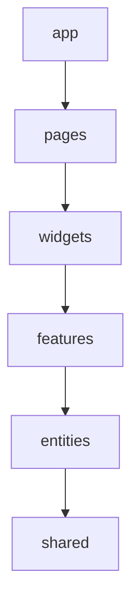

# FSD 아키텍처 가이드

- 참고: [카카오페이 기술블로그 FSD 적용기](https://tech.kakaopay.com/post/fsd/)
- 목적: 기능 단위 응집도 ↑, 레이어 단방향 의존성 ↓, 코드 위치 명확화

## 레이어

- 단방향 의존: `app -> pages -> widgets -> features -> entities -> shared`
- 역할
  - `app`: 앱 초기화/Provider/라우팅 설정
  - `pages`: 라우트 단위 페이지 조립
  - `widgets`: 페이지에 배치되는 독립 UI 블록(여러 feature 조합 가능)
  - `features`: 사용자 목표에 대응하는 상호작용 단위(폼, 플로우)
  - `entities`: 비즈니스 도메인 모델/쿼리/상태
  - `shared`: 공통 UI/유틸/라이브러리/설정

## 슬라이스 & 세그먼트

- 같은 레이어 내 슬라이스 간 직접 참조 금지.
- 세그먼트 예시: `ui/`, `api/`, `model/`, `lib/`, `config/` (components/hooks 같은 기술명 세그먼트는 지양).
- 기본 위치 예
  - `features/retrospective/ui/RetrospectiveForm.tsx`
  - `features/retrospective/api/retrospective.queries.ts`
  - `entities/retrospective/model/retrospective.types.ts`
  - `shared/ui/Button.tsx`, `shared/lib/date.ts`

## Public API & import 규칙

- 각 슬라이스 루트에 `index.ts`를 두고 외부 노출을 한정.
- 외부 import는 public API만 사용(내부 경로 침범 금지).
- `app`은 세팅·Provider만, 비즈니스 로직 금지. `pages`는 조립 중심.

## 코드 배치 규칙

- 신규 코드는 FSD 레이어에 배치. 기존 `src/components`, `src/api` 등은 유지하되 점진 이관.
- 페이지 로직은 `pages/*`, 비즈니스/데이터는 `features`/`entities`, 공통은 `shared`.
- API 키/엔드포인트/쿼리 키는 도메인 가까이(`entities/.../api` or `features/.../api`).

## 의존성 예시 (mermaid)

- `features`는 `entities`, `shared`만 참조.
- `widgets`는 `features`/`entities`/`shared` 참조 가능.
- `pages`는 `widgets`/`features`/`entities`/`shared` 참조 가능.
- `app`은 모든 하위 레이어를 조립하되 비즈니스 로직 없음.

## 네이밍 & 기타

- 슬라이스 이름은 도메인/기능 단위(kebab-case). 세그먼트 파일명은 PascalCase 컴포넌트, camelCase 훅/유틸.
- cross-cutting concern(로그, 에러 처리)은 `shared/lib` 또는 `app` 설정으로 한정.***

## Slice grouping

- 동일 도메인 데이터를 다루는 여러 페이지는 한 그룹 아래 슬라이스로 묶을 수 있음(예: `pages/benefit/{list,detail,...}`).
- grouping 시에도 레이어 단방향/슬라이스 간 직접 참조 금지는 유지.

## API 배치 기준 (pages vs features vs entities)

- 특정 페이지 슬라이스 전용: `pages/<group>/<slice>/api`
- 동일 slice-group에서 재사용(기능 단위): `features/<feature>/api`
- 다수 페이지/도메인에서 재사용(데이터 도메인): `entities/<domain>/api`
- 전역 공통/유틸: `shared/api`
- 판단 기준: “이 API를 어디까지 재사용할 것인가?” → 재사용 범위가 넓어질수록 낮은 레이어로 이동.

## Bottom-up 도입 가이드

1) 신규 코드는 `pages`에 먼저 배치.  
2) 동일 그룹 내 다른 슬라이스가 재사용하면 `features/<group>`로 승격.  
3) 여러 그룹/도메인에서 재사용되면 `entities/<domain>`로 승격.  
4) 전역/비즈니스 무관 공통은 `shared`로 이동.  

이 규칙을 반복 적용해 점진적으로 FSD 정합성을 확보한다.
